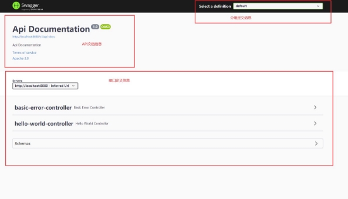
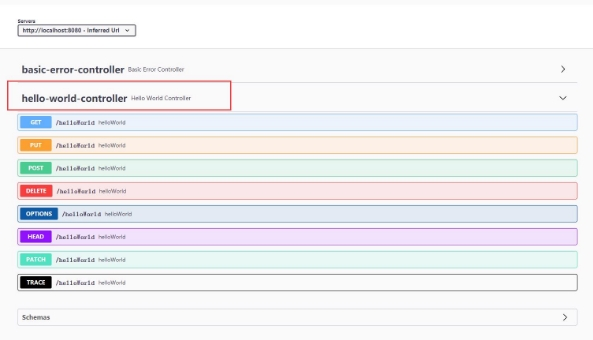
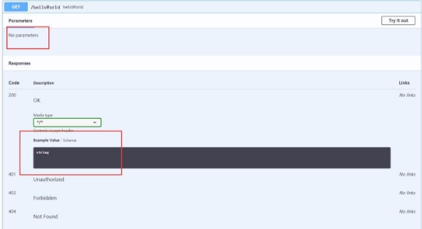
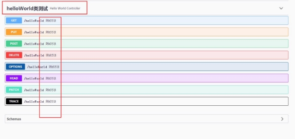
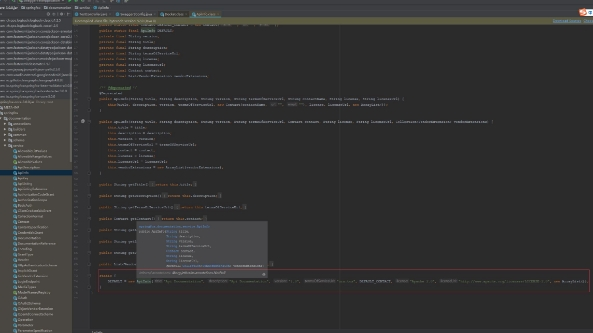
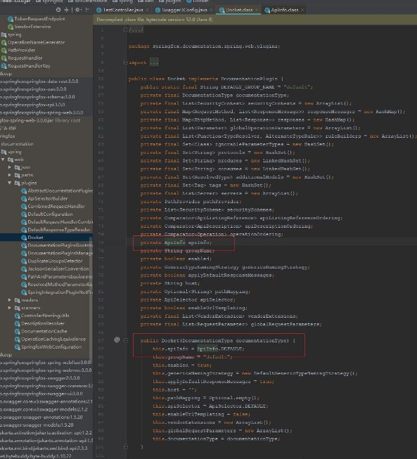

# 1.Swagger3 简介

Swagger（丝袜哥）是一个简单但功能强大的API表达工具。它具有地球上最大的API工具生态系统，数 以千计的开发人员，使用几乎所有的现代编程语言，都在支持和使用Swagger。使用Swagger生成API， 我们可以得到交互式文档，自动生成代码的SDK以及API的发现特性等。

前后端分离的项目，接口文档的存在十分重要。与手动编写接口文档不同，swagger是一个自动生成接 口文档的工具，在需求不断变更的环境下，手动编写文档的效率实在太低。与swagger2相比新版的 swagger3配置更少，使用更加方便。

官网 <https://swagger.io/>

在线编辑器 [http://editor.swagger.io/ ](http://editor.swagger.io/)Swagger作用：

- 将项目中所有的接口展现在页面上，这样后端程序员就不需要专门为前端使用者编写专门的接口文 档；
  - 当接口更新之后，只需要修改代码中的 Swagger 描述就可以实时生成新的接口文档了，从而规避 了接口文档老旧不能使用的问题；
    - 通过 Swagger 页面，我们可以直接进行接口调用，降低了项目开发阶段的调试成本。

现在SWAGGER官网主要提供了几种开源工具，提供相应的功能。可以通过配置甚至是修改源码以达到 你想要的效果

**Swagger Codegen**: 通过Codegen 可以将描述文件生成html格式和cwiki形式的接口文档，同时也能生 成多钟语言的服务端和客户端的代码。支持通过jar包，docker，node等方式在本地化执行生成。也可 以在后面的Swagger Editor中在线生成。

**Swagger UI**:提供了一个可视化的UI页面展示描述文件。接口的调用方、测试、项目经理等都可以在该 页面中对相关接口进行查阅和做一些简单的接口请求。该项目支持在线导入描述文件和本地部署UI项 目。

**Swagger Editor**: 类似于markendown编辑器的编辑Swagger描述文件的编辑器，该编辑支持实时预览 描述文件的更新效果。也提供了在线编辑器和本地部署编辑器两种方式。

**Swagger Inspector**: 感觉和postman差不多，是一个可以对接口进行测试的在线版的postman。比在 Swagger UI里面做接口请求，会返回更多的信息，也会保存你请求的实际请求参数等数据。

**Swagger Hub**：集成了上面所有项目的各个功能，你可以以项目和版本为单位，将你的描述文件上传到 Swagger Hub中。在Swagger Hub中可以完成上面项目的所有工作，需要注册账号，分免费版和收费版。

# **2.Swagger3 HelloWorld实现**

## **第一步: 添加Swagger依赖**（gradle版本）

```xml
// https://mvnrepository.com/artifact/io.springfox/springfox-boot-starter
implementation group: 'io.springfox', name: 'springfox-boot-starter', version: '3.0.0'
```


**添加Swagger依赖（maven版本）**

```xml
<!-- https://mvnrepository.com/artifact/io.springfox/springfox-boot-starter -->
<dependency>
    <groupId>io.springfox</groupId>
    <artifactId>springfox-boot-starter</artifactId>
    <version>3.0.0</version>
</dependency>
```

这里用的是 springfox，**Swagger 可以看作是一个遵循了 OpenAPI 规范的一项技术，而 springfox 则 是这项技术的具体实现。**

类似 JDBC是一套技术规范，各大数据库都有JDBC的实现；


**SpringBoot2.6.X高版本启动问题**

SpringBoot2.6.X版本集成Swagger空指针原因是:Springfox使用的路径匹配是基于AntPathMatcher的，而Spring Boot 2.6.X使用的是PathPatternMatcher。 

```yaml
// 解决： 修改application.yml spring: mvc: pathmatch: matching-strategy: ANT_PATH_MATCHER

spring:
  mvc:
    pathmatch:
      matching-strategy: ant_path_matcher
```


## **第二步：开启Swagger**


在 Spring Boot 的启动类添加 @EnableOpenApi 注解，开启 Swagger支持；

```java
import org.springframework.boot.SpringApplication;

import org.springframework.boot.autoconfigure.SpringBootApplication;
import springfox.documentation.oas.annotations.EnableOpenApi;

@EnableOpenApi
@SpringBootApplication
public class SwaggerTestApplication {

`   `public static void main(String[] args) {
`     `SpringApplication.run(SwaggerTestApplication.class, args);    
	}

}
```

## **第三步：新建HelloWorldController.java控制器类**

```java
import org.springframework.web.bind.annotation.RequestMapping;

import org.springframework.web.bind.annotation.RestController;

@RestController
public class HelloWorldController {
	@RequestMapping("/helloWorld")    
    public String helloWorld(){
        return "helloWorld";
    }
}
```

启动项目，浏览器输入：<http://localhost:8080/helloWorld>


没问题；

## **第四步：访问swagger-ui，查看接口文档**

浏览器访问：[http://localhost:8080/swagger-ui/ ](http://localhost:8080/swagger-ui/)显示如下图：主要三大区域，分组定义信息区块，API文档上信息区块以及最重要的接口定义信息区块；



展开HelloWorldController接口定义：



这里我们能看到枚举了所有可能的请求类型，因为我们用了 @RequestMapping ，以及请求地址/helloWorld ，我们再点开任意一个请求，



我们可以看到，接口没有参数，返回值是 String 类型；

这里描述了完整的接口定义信息；前端开发人员一目了然，假如接口定义变化，前端开发人员刷新下 swagger-ui就能及时看到，比起以往的人工编写接口文档方便很多；

## **第五步：Swagger注解描述接口**

在接口描述的时候，控制器类，以及方法，参数，返回值等，默认的话，是英文无备注信息，可能会让 前端开发人员看起来吃力，会增加沟通成本；

Swagger提供一套注解，我们给接口添加中文注释； 我们在类上添加 @API 注解，以及在方法上添加 @ApiOperation 注解


```java
import io.swagger.annotations.Api;
import io.swagger.annotations.ApiOperation;
import org.springframework.web.bind.annotation.RequestMapping;
import org.springframework.web.bind.annotation.RestController;


@Api(tags="helloWorld类测试")
@RestController
public class HelloWorldController {
	@ApiOperation("测试方法")
	@RequestMapping("/helloWorld")    
	public String helloWorld(){
		return "helloWorld";
	}
}
```



重启项目，刷新swagger-ui，发现已经以后中文注释了；

# **3.Swagger3 常用配置注解讲解**

**Swagger3常用配置如下：** 

1.swagger提供了一些配置用来描述接口，下面是一些常用的注解，必须掌握；

```xml
@Api：用在请求的类上，表示对类的说明
	tags="说明该类的作用，可以在UI界面上看到的注解"
	value="该参数没什么意义，在UI界面上也看到，所以不需要配置"

@ApiOperation：用在请求的方法上，说明方法的用途、作用
	value="说明方法的用途、作用"
	notes="方法的备注说明"

@ApiImplicitParams：用在请求的方法上，表示一组参数说明
	@ApiImplicitParam：用在@ApiImplicitParams注解中，指定一个请求参数的各个方面
		name：参数名
		value：参数的汉字说明、解释
		required：参数是否必须传
		paramType：参数放在哪个地方
            header --> 请求参数的获取：@RequestHeader
            query --> 请求参数的获取：@RequestParam
            path（用于restful接口）--> 请求参数的获取：@PathVariable
            div（不常用）
            form（不常用）  

		dataType：参数类型，默认String，其它值dataType="Integer"    
		defaultValue：参数的默认值

@ApiResponses：用在请求的方法上，表示一组响应
	@ApiResponse：用在@ApiResponses中，一般用于表达一个错误的响应信息
		code：数字，例如400
		message：信息，例如"请求参数没填好"
		response：抛出异常的类

@ApiModel：用于响应类上，表示一个返回响应数据的信息
			（这种一般用在post创建的时候，使用@RequestBody这样的场景，
			请求参数无法使用@ApiImplicitParam注解进行描述的时候）
	@ApiModelProperty：用在属性上，描述响应类的属性
```


2. **实例一**  @ApiImplicitParams **和** @ApiImplicitParam **参数描述**

   post方式，根据name和age两个参数查询数据，返回信息；

​		我们用 @ApiImplicitParams 和@ApiImplicitParam ，描述请求参数

```java
@PostMapping("/search")
@ApiImplicitParams({
		@ApiImplicitParam(name = "name",value = "姓名",required = true,paramType = "query"),
		@ApiImplicitParam(name = "age",value = "年龄",required = true,paramType = "query",dataType = "Integer")
})
@ApiOperation("测试查询")
public String search(String name,Integer age){
    return name+":"+age;
}
```

swagger控制台显示：


3. **实例二**  @ApiModel **,** @ApiModelProperty **实体参数描述

   ​	我们搞一个用户信息添加,使用 @ApiModel ,@ApiModelProperty 注解来描述输入参数；

    先搞一个用户信息实体User.java

```java
package com.demo.swaggertest.entity;
import io.swagger.annotations.ApiModel;
import io.swagger.annotations.ApiModelProperty;

@ApiModel("用户信息实体")
public class User {
    @ApiModelProperty("编号")
    private Integer id;
    @ApiModelProperty("姓名")
    private String name;
    @ApiModelProperty("年龄")
    private Integer age;
    public User() {
    }
    public User(Integer id, String name, Integer age) {
        this.id = id;
        this.name = name;
        this.age = age;
    }
    public String getName() {
        return name;
    }
    public void setName(String name) {
        this.name = name;
    }
    public Integer getAge() {
        return age;
    }
    public void setAge(Integer age) {
        this.age = age;
    }
    public Integer getId() {
        return id;
    }

    public void setId(Integer id) {
        this.id = id;
    }

    @Override
    public String toString() {
        return "User{" +
                "id=" + id +
                ", name='" + name + '\'' + ", age=" + age +
                '}';
    }
}
```


参数上，直接用 User user

```java
@PostMapping("/add")
@ApiOperation("测试添加")
public String add(User user){
    return user.getName()+":"+user.getAge();
} 
```

swagger控制台显示：


4. **实例三**  @ApiResponses **，** @ApiResponse

我们搞一个根据id获取用户信息案例，通过 @PathVariable 获取id，返回User对象，以及通过@ApiResponses ，@ApiResponse ，描述响应码对应的描述信息

```java
	@GetMapping("/user/{id}")
    @ApiOperation("根据ID获取用户信息")
    @ApiImplicitParams({
            @ApiImplicitParam(name = "id", value = "用户编号", required = true, paramType = "path")
    })
    @ApiResponses({
            @ApiResponse(code = 408, message = "指定业务得报错信息，返回客户端"),
            @ApiResponse(code = 400, message = "请求参数没填好"),
            @ApiResponse(code = 404, message = "请求路径没有或页面跳转路径不对")
    })
    public User load(@PathVariable("id") Integer id) {
        return new User(id, "jack", 32);
    }
```

swagger控制台显示：


**Schemas**也对应有视图用户实体描述信息显示：


# **4.Swagger3 接口测试**

swagger-ui图形客户端提供了接口测试功能；


默认情况下，这些参数都不能填写，禁用的；


我们点击“Try it out”按钮；即可开启接口测试功能；


输入请求参数后，点击“Execute‘按钮，即可执行，下方是后端返回信息； 类似的，我们可以测试添加功能；


说明：很多时候，前后端分离，传的是json，键值对，用swagger-ui提供的简陋接口测试工具很难用， 所以接口测试我们还是用专业的 postman

# **5.Swagger3 API信息配置**

默认情况，显示的API信息如下：


通过源码，我们可以看到：这个信息是通过 springfox.documentation.service.ApiInfo.java 类来构造的；



最终通过 springfox.documentation.spring.web.plugins.Docket.java 类的构造方法传入ApiInfo 类来最终构造；



我们要修改API信息默认配置的话，可以通过新建一个 com.swaggerdemo.config.Swagger3Config.java 配置类，重写 ApiInfo 实现，以及重写 Docket 实现并且设置apiInfo；

```java
import org.springframework.context.annotation.Bean;
import org.springframework.context.annotation.Configuration;
import springfox.documentation.service.ApiInfo;
import springfox.documentation.service.Contact;
import springfox.documentation.spi.DocumentationType;
import springfox.documentation.spring.web.plugins.Docket;
import java.util.ArrayList;

@Configuration
public class Swagger3Config {
    /**
     * 配置swagger的Docket bean
     * @return
     */
    @Bean
    public Docket createRestApi() {
        return new Docket(DocumentationType.OAS_30).apiInfo(createApiInfo());  // 指定swagger3.0版本
    }

    /**
     * 配置swagger的ApiInfo bean
     * @return
     */
    @Bean
    public ApiInfo createApiInfo() {
        return new ApiInfo("Swagger"
                , "Api Documentation"
                , "3.0"
                , "xxxxxxxxxx"
                , new Contact("张三", "xxxxxxx", "xxxxxxxx@126.com")
                , "Apache 2.0"
                , "http://www.apache.org/licenses/LICENSE-2.0", new ArrayList());
    }
}
```

 重启项目，我们发现，APIInfo信息变了；


这个API信息主要作用是让前端开发人员看的，谁开发的接口，或者哪个小组负责，有问题方便联系沟通；

# **6.Swagger3 Docket 开关&过滤&分组 配置详解**

我们可以通过设置Docket，可以配置很多功能，比如是否开启swagger，过滤，分组等；

1. **开关设置enable** 一般情况，我们只有在开发环境才会用到swagger，正式环境需要关闭swagger，一个是安全问题，还

有一个是用了swagger会影响系统运行速度；

我们通过设置Docket对象的enable即可；

```java
	/**
     * 配置swagger的Docket bean
     *
     * @return
     */
    @Bean
    public Docket createRestApi() {
        return new Docket(DocumentationType.OAS_30)  // 指定swagger3.0版本
                .apiInfo(createApiInfo())
                .enable(false);
    }
```


设置后，重启项目，发现已经看不到API信息了；

2. **设置过滤** 有些情况，我们需要指定固定包路径下的类生成API，或者根据前端用户路径请求过滤； 使用过滤，必须先调用 select 方法；

通过apis方法， 

basePackage 可以根据包路径来生成特定类的API,

any 方法是默认所有都有效， none 方法都无效；

withClassAnnotation 根据类注解， 

withMethodAnnotation 是根据方法注解； 一般我们用的是basePackage 方法；


具体实例：

```java
/**
     * 配置swagger的Docket bean
     *
     * @return
     */
    @Bean
    public Docket createRestApi() {
        return new Docket(DocumentationType.OAS_30)  // 指定swagger3.0版本
                .select()
                .apis(RequestHandlerSelectors.basePackage("com.demo.swaggertest.controller"))
                .build()
                .apiInfo(createApiInfo())
                .enable(true);
    }
```

最后要加 build() 方法；

类似的还有一个根据请求路径的 paths 方法；

一般用 ant 匹配路径；

any 是匹配任意路径， none 是都不匹配， regex 是正则匹配；


具体实例：

```java
	/**
     * 配置swagger的Docket bean
     *
     * @return
     */
    @Bean
    public Docket createRestApi() {
        return new Docket(DocumentationType.OAS_30)  // 指定swagger3.0版本
                .select()
                .paths(PathSelectors.ant("/**")) //匹配 /**请求路径
                .build()
                .apiInfo(createApiInfo())
                .enable(true); //开关
    }
```

swagger-ui视图只显示过滤后的API接口信息；


3. **设置分组**

在实际项目开发中，把复杂项目划分多模块给多个小组或者多个人负责开发，所以每个小组或者个人要 实现自己的分组，方便查找到API接口开发负责人，沟通和处理问题；

我们通过 groupName 方法可以设置组名； 实例：

```java
@Bean
public Docket createRestApi() {
    return new Docket(DocumentationType.OAS_30)  // 指定swagger3.0版本             
        .groupName("开发组001")
        .enable(true)  // 开关
        .select()
        .build()
        .apiInfo(createApiInfo());
} 
```


刷新界面：


发现组名变了；

现在话，我们结合前面学过的过滤，通过apis的basePackage方法，搞两个组，分别扫描不同的包路径；

模拟分组开发，controller包下建两个子包，分别是one和two包，用来模拟两个业务模块；


简单搞个 HelloWorldController2


```java
import io.swagger.annotations.*;
import org.springframework.web.bind.annotation.GetMapping;
import org.springframework.web.bind.annotation.RestController;

@Api(tags = "helloWorld测试类2")
@RestController
public class HelloWorldController2 {
    @ApiOperation("测试方法2")
    @GetMapping("/helloWorld2")
    public String helloWorld() {
        return "hello world2";
    }
}
```

我们搞两个 Docket 和两个 ApiInfo


```java
import org.springframework.context.annotation.Bean;

import org.springframework.context.annotation.Configuration;
import springfox.documentation.builders.PathSelectors;
import springfox.documentation.builders.RequestHandlerSelectors;
import springfox.documentation.service.ApiInfo;

import springfox.documentation.service.Contact;

import springfox.documentation.spi.DocumentationType;
import springfox.documentation.spring.web.plugins.Docket;

import java.util.ArrayList;

@Configuration
public class Swagger3Config {
    /**
     * 配置swagger的Docket bean
     *
     * @return
     */
    @Bean
    public Docket createRestApi() {
        return new Docket(DocumentationType.OAS_30)  // 指定swagger3.0版本
                .groupName("开发者001")
                .select()
                .apis(RequestHandlerSelectors.basePackage("com.demo.swaggertest.controller.one"))   //扫描指定的包 常用方式
                .build()
                .apiInfo(createApiInfo())
                .enable(true);
    }

    @Bean
    public Docket createRestApi2() {
        return new Docket(DocumentationType.OAS_30)  // 指定swagger3.0版本
                .groupName("开发者002")
                .select()
                .apis(RequestHandlerSelectors.basePackage("com.demo.swaggertest.controller.two"))   //扫描指定的包 常用方式
                .build()
                .apiInfo(createApiInfo2())
                .enable(true);
    }

    /**
     * 配置swagger的ApiInfo bean
     *
     * @return
     */
    @Bean
    public ApiInfo createApiInfo() {
        return new ApiInfo("Swagger"
                , "Api Documentation"
                , "3.0"
                , "xxxxxxxxxx"
                , new Contact("张三", "xxxxxxx", "xxxxxxxx@126.com")
                , "Apache 2.0"
                , "http://www.apache.org/licenses/LICENSE-2.0", new ArrayList());
    }

    @Bean
    public ApiInfo createApiInfo2() {
        return new ApiInfo("Swagger"
                , "Api Documentation"
                , "3.0"
                , "xxxxxxxxxx"
                , new Contact("李四", "xxxxxxx", "xxxxxxxx@126.com")
                , "Apache 2.0"
                , "http://www.apache.org/licenses/LICENSE-2.0", new ArrayList());
    }
}
```

启动项目运行；

开发组001


开发组002


测试OK;


# **7.Swagger3 导出离线文档**

## 添加knife4j依赖（maven版本）

在pom.xml中增加knife4j的依赖：

```xml
<!-- https://mvnrepository.com/artifact/com.github.xiaoymin/knife4j-spring-boot-starter -->
<dependency>
    <groupId>com.github.xiaoymin</groupId>
    <artifactId>knife4j-spring-boot-starter</artifactId>
    <version>3.0.3</version>
</dependency>
```

**gradle版本**

```xml
// https://mvnrepository.com/artifact/com.github.xiaoymin/knife4j-spring-boot-starter
implementation group: 'com.github.xiaoymin', name: 'knife4j-spring-boot-starter', version: '3.0.3'
```


## 启动knife4j

在上面配置Swagger的Swagger3Config中添加@EnableKnife4j注解，该注解可以开启knife4j的增强功能。

```java
@EnableKnife4j
@Configuration
@EnableOpenApi
public class Swagger3Config {
    // ...
}
```

此时，如果依旧访问http://localhost:8080/swagger-ui/index.html会发现显示并没有变化。这里我们需要访问http://localhost:8088/doc.html。

整个项目源码地址：https://github.com/secbr/springboot-all/tree/master/springboot-swagger3。

#### 展示效果

此时启动项目，访问doc.html之后，你会发现现在文档风格变得非常酷炫。展示几个效果图来看看：
